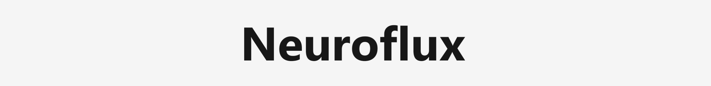
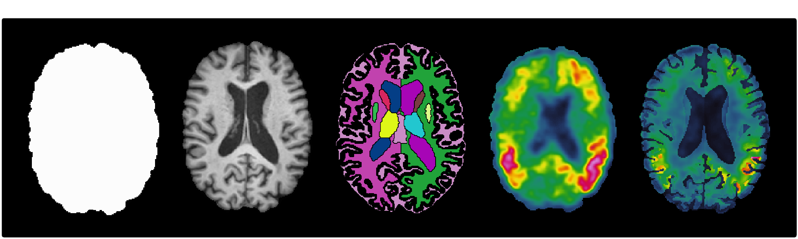

<div align="center">
    <a href="https://img.shields.io/badge/Python-3.9-blue?style=for-the-badge" alt="Python"></a>
    <a href="https://img.shields.io/badge/License-GPL--3.0-lightgrey?style=for-the-badge"></a>
    <a href="https://github.com/antonioscardace/Neuroflux/actions/workflows/cd-docker-publish.yml"></a>
</div>
<br/>

Neuroflux is a fully **CPU-based** preprocessing pipeline for **paired sMRI and PET** data, built on top of powerful open-source neuroimaging tools. Given a T1w sMRI scan and its corresponding PET acquisition from the same visit, together with a reference space such as **MNI152**, it produces a set of standardized and analysis-ready outputs, each saved as an **independent** derivative.

For the sMRI scan, Neuroflux generates a registered, skull-stripped and intensity-normalized image, a binary brain mask, a multi-ROI segmentation obtained with SynthSeg 2.0, and a dedicated CSV containing ROI-wise volumetric measures. This segmentation comprises around **100 ROIs** based on the **Desikan–Killiany** atlas. For the PET scan, Neuroflux produces a T1-aligned and template-registered image, a skull-stripped version, a PVC-corrected reconstruction and an SUVR-normalized map. Each of these outputs is saved independently, and an additional CSV reports ROI-level uptake features using the same atlas.<br/>

<p align="center"></p>

## Installation

The use of a dedicated virtual environment, like [Anaconda](https://www.anaconda.com/), is recommended to avoid dependency conflicts.<br/>
To run the entire pipeline, [Docker](https://docs.docker.com/get-docker/) is needed and must be downloaded.<br/>
Clone the repository and install the package in editable mode:

```console
git clone https://github.com/antonioscardace/Neuroflux.git
cd neuroflux/
pip install -e .
```

## Usage

The `n_threads` parameter is optional. By default, Neuroflux automatically selects the maximum number of available physical CPU cores (excluding logical ones) to avoid oversubscription and ensure optimal performance without counterproductive overhead.

```console
python3 scripts/neuroflux.py \
  --mri_path PATH \
  --pet_path PATH \
  --template_path PATH \
  --mri_output_dir PATH \
  --path_output_dir PATH \
  --n_threads INT \
  --verbose
```

## Citations

```
[1] Avants et al. (2009): Advanced normalization tools (ANTs). The Insight Journal, 2(365), 1–35.
[2] Marcoux et al. (2018): An automated pipeline for the analysis of PET data on the cortical surface. Frontiers in Neuroinformatics.
[3] Isensee et al. (2019): Automated brain extraction of multi‑sequence MRI using artificial neural networks. Human Brain Mapping.
[4] López‑González et al. (2020): Intensity normalization methods in brain FDG‑PET quantification. NeuroImage, 222, 117229.
[5] Tustison et al. (2021): The ANTsX ecosystem for quantitative biological and medical imaging: ANTsR, ANTsPy, and deep learning. Nature Communications.
[6] Billot et al. (2023): SynthSeg: Segmentation of brain MRI scans of any contrast and resolution without retraining. Medical Image Analysis, 83, 102789.
```
